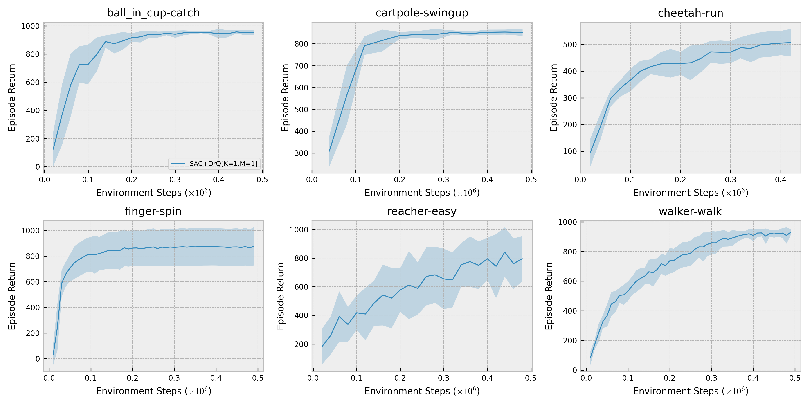

[](https://zenodo.org/badge/latestdoi/330059679)

# JAX (Flax) RL

This repository contains JAX (Flax) implementations of Reinforcement Learning algorithms:

* [Soft Actor Critic with learnable temperature](https://arxiv.org/abs/1812.05905)
* [Advantage Weighted Actor Critic](https://arxiv.org/abs/2006.09359)
* [Image Augmentation Is All You Need](https://arxiv.org/abs/2004.13649)(only [K=1, M=1])
* [Deep Deterministic Policy Gradient](https://arxiv.org/abs/1509.02971) with [Clipped Double Q-Learning](https://arxiv.org/abs/1802.09477)
* [Randomized Ensembled Double Q-Learning: Learning Fast Without a Model](https://arxiv.org/abs/2101.05982)
* Behavioral Cloning

The goal of this repository is to provide simple and clean implementations to build research on top of. **Please do not use this repository for baseline results and use the original implementations instead ([SAC](https://github.com/rail-berkeley/softlearning/), [AWAC](https://github.com/vitchyr/rlkit/tree/master/examples/awac), [DrQ](https://github.com/denisyarats/drq)).**

If you use JAXRL in your work, please cite this repository in publications:
```
@misc{jaxrl,
  author = {Kostrikov, Ilya},
  doi = {10.5281/zenodo.5535154},
  month = {10},
  title = {{JAXRL: Implementations of Reinforcement Learning algorithms in JAX}},
  url = {https://github.com/ikostrikov/jaxrl},
  year = {2021}
}
```

# Changelog

## January 10th, 2022
- Added an implementation of [Randomized Ensembled Double Q-Learning: Learning Fast Without a Model](https://arxiv.org/abs/2101.05982)

## July 20th, 2021
- Added an implementation of [Deep Deterministic Policy Gradient](https://arxiv.org/abs/1509.02971) with [Clipped Double Q-Learning](https://arxiv.org/abs/1802.09477)

## May 19th, 2021
- Added an implementation of [Soft Actor Critic v1](https://arxiv.org/abs/1801.01290)

## April 29th, 2021
- Added an implementation of data augmentation from [Image Augmentation Is All You Need](https://arxiv.org/abs/2004.13649)

# Installation

```bash
conda install patchelf
pip install dm_control
pip install --upgrade git+https://github.com/ikostrikov/jaxrl
# For GPU support run
pip install --upgrade "jax[cuda]" -f https://storage.googleapis.com/jax-releases/jax_releases.html
```

If you want to run this code on GPU, please follow instructions from [the official repository](https://github.com/google/jax).

Please follow [the instructions](https://github.com/openai/mujoco-py/pull/583/files) to build mujoco-py with fast headless GPU rendering.

# Development 

If you want to modify the code, install following the instructions below.

```bash
conda install patchelf
pip install --upgrade -e .
```

# [Examples](examples/)

# Troubleshooting

If you experience out-of-memory errors, especially with enabled video saving, please consider reading [docs](https://jax.readthedocs.io/en/latest/gpu_memory_allocation.html#gpu-memory-allocation) on JAX GPU memory allocation. Also, you can try running with the following environment variable:

```bash
XLA_PYTHON_CLIENT_MEM_FRACTION=0.80 python ...
```

If you run your code on a remote machine and want to save videos for DeepMind Control Suite, please use EGL for rendering:
```bash
MUJOCO_GL=egl python train.py --env_name=cheetah-run --save_dir=./tmp/ --save_video
```

# Tensorboard

Launch tensorboard to see training and evaluation logs

```bash
tensorboard --logdir=./tmp/
```

# Results

## Continous control from states


## Continous control from pixels




# Docker

## Build

Copy your MuJoCo key to ./vendor

```bash
cd remote
docker build -t ikostrikov/jaxrl . -f Dockerfile 
```

## Test
```bash
 sudo docker run -v <examples-dir>:/jaxrl/ ikostrikov/jaxrl:latest python /jaxrl/train.py --env_name=HalfCheetah-v2 --save_dir=/jaxrl/tmp/

# On GPU
 sudo docker run --rm --gpus all -v <examples-dir>:/jaxrl/ --gpus=all ikostrikov/jaxrl:latest python /jaxrl/train.py --env_name=HalfCheetah-v2 --save_dir=/jaxrl/tmp/
```

# Contributing

When contributing to this repository, please first discuss the change you wish to make via issue. If you are not familiar with pull requests, please read [this documentation](https://opensource.com/article/19/7/create-pull-request-github).

# Acknowledgements 

Thanks to [@evgenii-nikishin](https://github.com/evgenii-nikishin) for helping with JAX. And [@dibyaghosh](https://github.com/dibyaghosh) for helping with vmapped ensembles.
