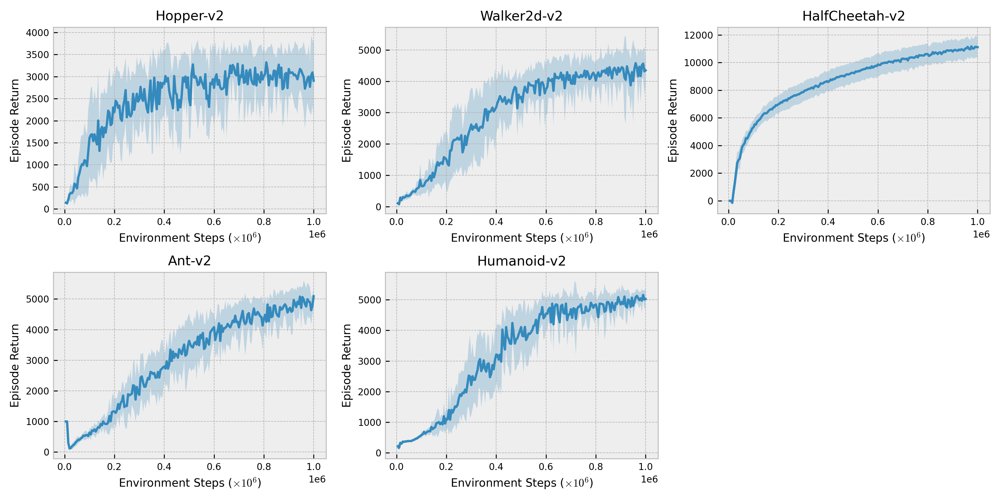

# Soft Actor-Critic in JAX

This is a JAX implementation of the Soft Actor-Critic (SAC) algorithm from the papers:
* [Soft Actor-Critic: Off-Policy Maximum Entropy Deep Reinforcement Learning with a Stochastic Actor](https://arxiv.org/abs/1801.01290)
* [Soft Actor-Critic Algorithms and Applications](https://arxiv.org/abs/1812.05905)

We use Flax, a neural network library on top of JAX built by Brain Team in Google Research.

The goal of this repository is to provide a simple and clean implementation to build research on top of. **Please do not use this repository for reporting baseline results and use the original implementation of SAC instead.**

# Installation

Install and activate an Anaconda environment
```bash
conda env create -f environment.yml 
conda activate jax-sac
```

If you want to use JAX with GPU, please follow [the official instructions](https://github.com/google/jax#installation).
For OpenAI Gym MuJoCo installation instructions, consult [the official repository](https://github.com/openai/mujoco-py).

# Run

```bash
python main.py --env_name=HalfCheetah-v2 --save_dir=./tmp/
```

# Results

We provide the returns for MuJoCo environments averaged over 10 runs using the code from [this commit](https://github.com/ikostrikov/jax-sac/commit/8a188ca915d1f04b965a199f9b18551f33fdb0f7).



Similar results can be obtained for [DeepMind Control Suite](https://github.com/deepmind/dm_control/tree/master/dm_control/suite).

# Contributing

When contributing to this repository, please first discuss the change you wish to make via creating a GitHub issue. If you are not familiar with pull requests, please read [this documentation](https://opensource.com/article/19/7/create-pull-request-github).
